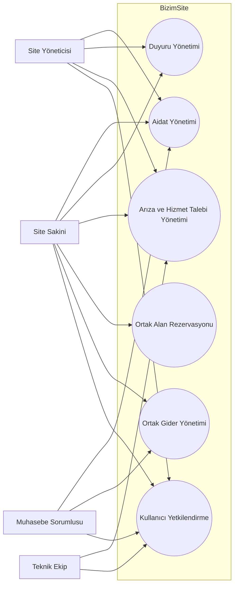

# BizimSite - Sistem Geneli Use Case Diyagramı

BizimSite sisteminde yer alan temel aktörler ile sistemin ana işlevsel modülleri arasındaki ilişkiler aşağıdaki use case diyagramında gösterilmiştir.

---

## Use Case Diyagramı

---

## Aktörler

### Site Sakini

Aidat bilgilerini, yayımlanmış duyuruları ve ortak gider kayıtlarını görüntüler. Arıza veya hizmet talebi oluşturur ve takip eder. Ortak alan rezervasyonu oluşturur, görüntüler ve iptal eder.

### Site Yöneticisi

Aidat, duyuru ve talep yönetimi süreçlerinde yetkili işlemleri gerçekleştirir.

### Muhasebe Sorumlusu

Aidat ve ortak gider kayıtlarının oluşturulması ve yönetilmesinden sorumludur.

### Teknik Ekip

Arıza ve hizmet taleplerini görüntüler ve talep durumlarını günceller.

---

## Genel Değerlendirme

Sistem geneli use case diyagramı, BizimSite sistemindeki temel aktörlerin ana işlevsel modüller ile olan ilişkilerini göstermektedir.

Detaylı kullanıcı etkileşimleri ilgili use case analizlerinde açıklanmıştır.
