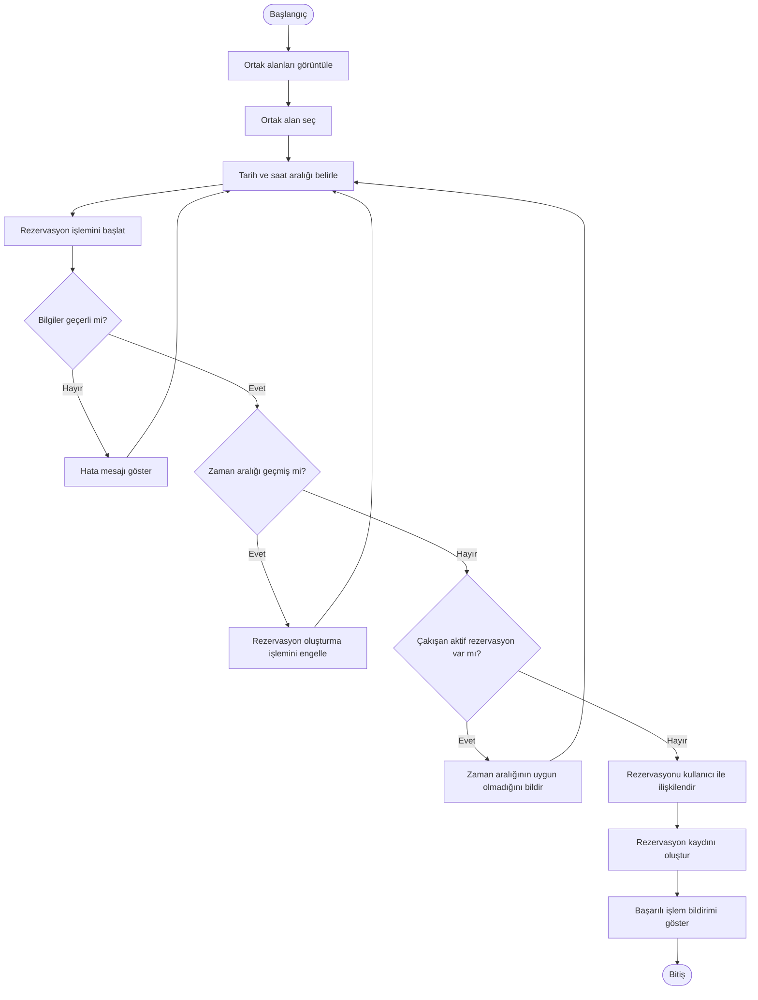

# BizimSite - Ortak Alan Rezervasyonu Activity Diagramı

BizimSite ortak alan rezervasyonu sürecinde site sakini ile sistem arasındaki temel işlem akışı aşağıdaki activity diagramında gösterilmiştir.

---

## Activity Diagramı

---

## Süreç Açıklaması

Site sakini rezervasyona açık bir ortak alan seçerek tarih ve saat aralığını belirler.

Sistem, rezervasyon bilgilerini doğrular ve seçilen zaman aralığının geçmiş tarihli olup olmadığını kontrol eder. Ardından aynı ortak alan için çakışan aktif bir rezervasyon bulunup bulunmadığını değerlendirir.

Tüm kontrollerin başarılı olması durumunda rezervasyon kullanıcı ile ilişkilendirilerek sistemde kayıt altına alınır.

---

## İlgili Use Case'ler

- UC-15 - Rezervasyona Açık Ortak Alanları Görüntüleme
- UC-16 - Ortak Alan Rezervasyonu Oluşturma

---

## Genel Değerlendirme

Ortak alan rezervasyonu activity diagramı, rezervasyon oluşturma sürecindeki temel karar noktalarını ve sistem kontrollerini görsel olarak açıklamaktadır.

Diyagram, rezervasyon sürecinin sistem tasarımı ve geliştirme aşamalarında değerlendirilmesinde referans olarak kullanılacaktır.
