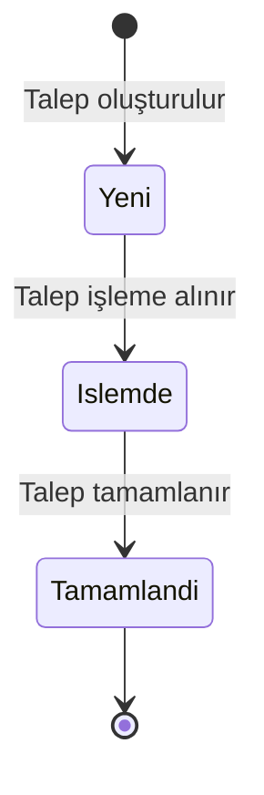

# BizimSite - Arıza ve Hizmet Talebi Durum Diyagramı

BizimSite arıza ve hizmet talebi sürecinde bir talebin sistem içerisindeki durum değişimleri aşağıdaki diyagramda gösterilmiştir.

---

## Durum Diyagramı

---

## Durum Açıklamaları

### Yeni

Site sakini tarafından oluşturulan ve henüz işleme alınmamış talepleri ifade eder.

### İşlemde

Yetkili kullanıcı veya ilgili teknik ekip tarafından işleme alınan talepleri ifade eder.

### Tamamlandı

İlgili işlemleri tamamlanan talepleri ifade eder.

---

## İlgili Use Case'ler

- UC-11 - Arıza veya Hizmet Talebi Oluşturma
- UC-12 - Kendi Taleplerini Görüntüleme
- UC-13 - Talep Durumunu Güncelleme
- UC-14 - Talepleri Görüntüleme

---

## Genel Değerlendirme

Arıza ve hizmet talebi durum diyagramı, sistemde oluşturulan taleplerin yaşam döngüsü boyunca geçebileceği temel durumları ve durumlar arasındaki geçişleri göstermektedir.

Diyagram, talep durum yönetiminin sistem tasarımı ve geliştirme aşamalarında değerlendirilmesinde referans olarak kullanılacaktır.
