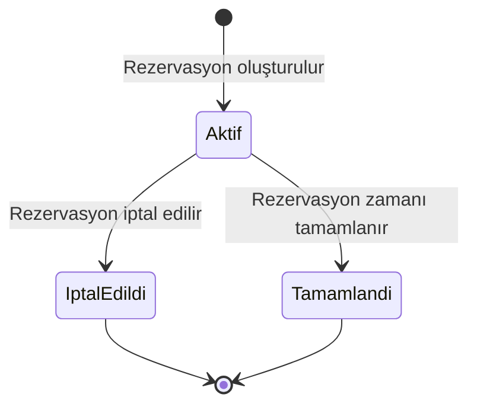

# BizimSite - Ortak Alan Rezervasyonu Durum Diyagramı

BizimSite ortak alan rezervasyonu sürecinde bir rezervasyon kaydının sistem içerisindeki durum değişimleri aşağıdaki diyagramda gösterilmiştir.

---

## Durum Diyagramı

---

## Durum Açıklamaları

### Aktif

Oluşturulmuş ve henüz gerçekleşmemiş rezervasyonları ifade eder.

### İptal Edildi

Site sakini tarafından iptal edilen rezervasyonları ifade eder.

### Tamamlandı

Rezervasyon tarih ve saat aralığı sona ermiş rezervasyonları ifade eder.

---

## İlgili Use Case'ler

- UC-16 - Ortak Alan Rezervasyonu Oluşturma
- UC-17 - Kendi Rezervasyonlarını Görüntüleme
- UC-18 - Rezervasyon İptal Etme

---

## Genel Değerlendirme

Ortak alan rezervasyonu durum diyagramı, rezervasyon kayıtlarının yaşam döngüsü boyunca geçebileceği temel durumları ve durumlar arasındaki geçişleri göstermektedir.

Diyagram, rezervasyon durum yönetiminin sistem tasarımı ve geliştirme aşamalarında değerlendirilmesinde referans olarak kullanılacaktır.
