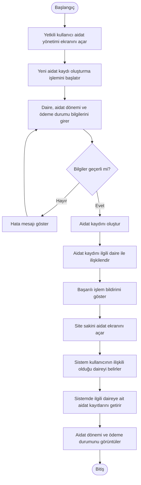

# BizimSite - Aidat Yönetimi Aktivite Diyagramı

BizimSite aidat yönetimi sürecinde aidat kaydının oluşturulması ve site sakini tarafından görüntülenmesine ilişkin temel işlem akışı aşağıdaki aktivite diyagramında gösterilmiştir.

---

## Aktivite Diyagramı

---

## Süreç Açıklaması

Yetkili kullanıcı, aidat kaydı için gerekli daire, aidat dönemi ve ödeme durumu bilgilerini girer.

Sistem, girilen bilgileri doğrular ve geçerli olması durumunda aidat kaydını ilgili daire ile ilişkilendirerek kayıt altına alır.

Site sakini aidat ekranına eriştiğinde sistem, kullanıcının ilişkili olduğu daireyi belirler ve yalnızca ilgili daireye ait aidat kayıtlarını görüntüler.

---

## İlgili Use Case'ler

- UC-01 - Kendi Aidat Bilgilerini Görüntüleme
- UC-02 - Aidat Kaydı Oluşturma
- UC-03 - Aidat Kaydını Güncelleme
- UC-04 - Aidat Ödeme Durumunu Görüntüleme

---

## Genel Değerlendirme

Aidat yönetimi aktivite diyagramı, aidat kayıtlarının oluşturulması ve site sakini tarafından görüntülenmesi süreçlerindeki temel işlem adımlarını ve sistem kontrollerini görsel olarak açıklamaktadır.

Diyagram, aidat yönetimi sürecinin sistem tasarımı ve geliştirme aşamalarında değerlendirilmesinde referans olarak kullanılacaktır.
