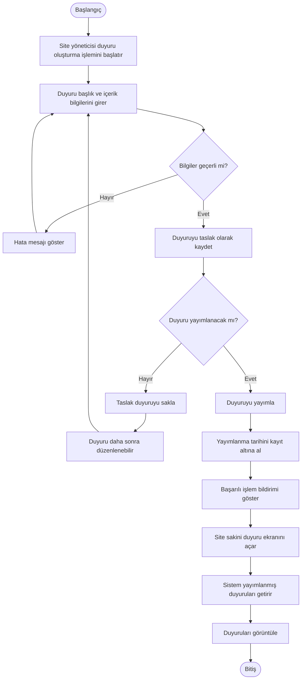

# BizimSite - Duyuru Yönetimi Aktivite Diyagramı

BizimSite duyuru yönetimi sürecinde duyurunun oluşturulması, taslak olarak kaydedilmesi, yayımlanması ve site sakinleri tarafından görüntülenmesine ilişkin temel işlem akışı aşağıdaki aktivite diyagramında gösterilmiştir.

---

## Aktivite Diyagramı

---

## Süreç Açıklaması

Site yöneticisi duyuru başlık ve içerik bilgilerini girerek yeni bir duyuru oluşturur.

Sistem, duyuru bilgilerini doğrular ve geçerli olması durumunda duyurunun taslak olarak kaydedilmesini sağlar. Taslak duyuru daha sonra düzenlenebilir veya yayımlanabilir.

Duyuru yayımlandığında yayımlanma tarihi kayıt altına alınır. Site sakinleri yalnızca yayımlanmış duyuruları görüntüleyebilir.

---

## İlgili Use Case'ler

- UC-05 - Duyuru Oluşturma
- UC-06 - Duyuruyu Taslak Olarak Kaydetme ve Düzenleme
- UC-07 - Duyuru Yayımlama
- UC-08 - Yayımlanmış Duyuruları Görüntüleme

---

## Genel Değerlendirme

Duyuru yönetimi aktivite diyagramı, duyurunun oluşturulmasından yayımlanmasına ve site sakinleri tarafından görüntülenmesine kadar geçen temel işlem akışını ve karar noktalarını görsel olarak açıklamaktadır.

Diyagram, duyuru yönetimi sürecinin sistem tasarımı ve geliştirme aşamalarında değerlendirilmesinde referans olarak kullanılacaktır.
