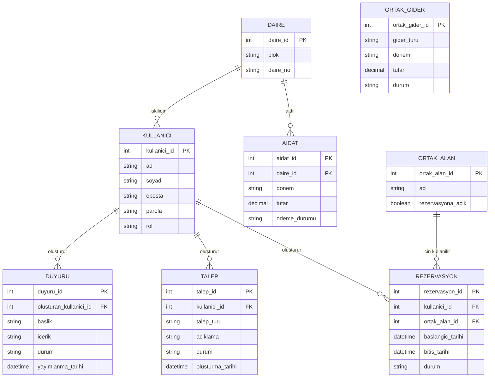

# BizimSite - Varlık İlişki Diyagramı

BizimSite sisteminde yer alan temel veri varlıkları ve bu varlıklar arasındaki ilişkiler aşağıdaki varlık ilişki diyagramında gösterilmiştir.

---

## Varlık İlişki Diyagramı

---

## Temel Varlıklar

### Kullanıcı

Sisteme erişen site sakini ve yetkili kullanıcıların temel bilgilerini temsil eder.

### Daire

Site içerisinde bulunan daire kayıtlarını temsil eder.

### Aidat

Dairelere ait dönemsel aidat kayıtlarını ve ödeme durumlarını temsil eder.

### Duyuru

Site yönetimi tarafından oluşturulan taslak veya yayımlanmış duyuru kayıtlarını temsil eder.

### Talep

Site sakinleri tarafından oluşturulan arıza ve hizmet taleplerini temsil eder.

### Ortak Alan

Rezervasyon işlemine konu olabilecek ortak kullanım alanlarını temsil eder.

### Rezervasyon

Site sakinlerinin ortak alanlar için oluşturduğu rezervasyon kayıtlarını temsil eder.

### Ortak Gider

Site veya apartmana ait ortak kullanım giderlerini temsil eder.

---

## İlişki Açıklamaları

Bir daire birden fazla aidat kaydına sahip olabilir. Her aidat kaydı yalnızca bir daire ile ilişkilidir.

Bir daire birden fazla kullanıcı ile ilişkilendirilebilir. Her kullanıcı bir daire ile ilişkilidir.

Bir kullanıcı birden fazla duyuru, talep veya rezervasyon kaydı oluşturabilir.

Bir ortak alan birden fazla rezervasyon kaydına sahip olabilir. Her rezervasyon yalnızca bir ortak alan ile ilişkilidir.

---

## Genel Değerlendirme

Varlık ilişki diyagramı, BizimSite sisteminde yönetilecek temel veri varlıklarını ve bu varlıklar arasındaki ilişkileri göstermektedir.

Diyagram, veritabanı tasarımının detaylandırılması ve sistem veri modelinin oluşturulması süreçlerinde referans olarak kullanılacaktır.
