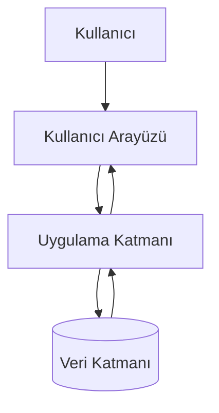

# BizimSite - Sistem Mimarisi Diyagramı

BizimSite sisteminin temel katmanları ve bu katmanlar arasındaki iletişim aşağıdaki mimari diyagramda gösterilmiştir.

---

## Sistem Mimarisi

---

## Mimari Açıklamaları

### Kullanıcı

Site sakini veya yetkili kullanıcı, sistem işlemlerini kullanıcı arayüzü üzerinden gerçekleştirir.

### Kullanıcı Arayüzü

Kullanıcıdan gelen istekleri alır ve uygulama katmanına iletir. İşlem sonuçlarını kullanıcıya gösterir.

### Uygulama Katmanı

İş kurallarını, yetkilendirme kontrollerini ve doğrulama işlemlerini gerçekleştirir.

### Veri Katmanı

Sistem verilerinin saklanmasını ve yönetilmesini sağlar.

---

## İşlem Akışı

1. Kullanıcı sistem üzerinden bir işlem başlatır.
2. İşlem kullanıcı arayüzü tarafından alınır.
3. Uygulama katmanı gerekli iş kurallarını ve doğrulamaları uygular.
4. Veri katmanında gerekli kayıt işlemleri gerçekleştirilir.
5. İşlem sonucu kullanıcı arayüzü aracılığıyla kullanıcıya iletilir.

---

## Genel Değerlendirme

Sistem mimarisi diyagramı, BizimSite uygulamasının katmanlı yapısını ve katmanlar arasındaki temel iletişim akışını göstermektedir.

Bu diyagram, sistem tasarımının anlaşılmasını kolaylaştırmak ve geliştirme sürecinde referans oluşturmak amacıyla hazırlanmıştır.
